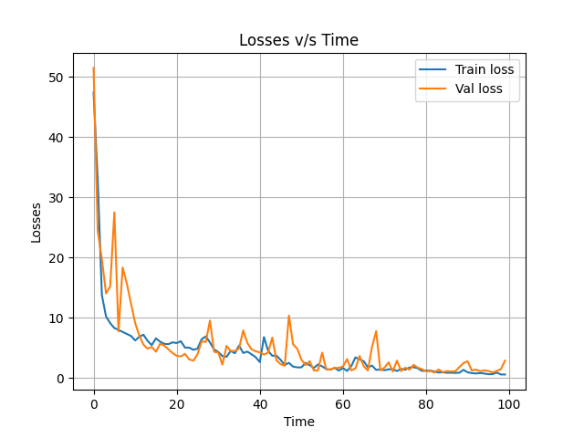
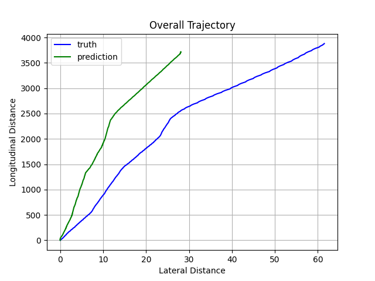

# __Imitation Learning__
  
PyTorch-based library for imitation learning using Behaviour cloning for self-driving cars. Provides the provision of using :
    
- RNN architecture (GRU, LSTM etc.)
- Vision backbone (CNN, Vision Transformer)

# __Installation__
To install locally, using  ```setuptools```:
```bash
git clone git@github.com:sachdevkartik/autobrains.git
cd autobrains

sudo apt-get update && apt-get install python3-pip
pip3 install .
```
OR using  ```requirements.txt```:

```
git clone git@github.com:sachdevkartik/autobrains.git
cd autobrains

pip3 install -r requirements.txt
```

**Note**: Installation using docker is not tested yet due to space issues in my workstation

# __Training__

Modify the configuration of the chosen model and training scheme from ```config``` folder. Run the script:

```bash
# training with cnn
python3 scripts/main.py  --model cnn --model_config ../config/baseline.yaml --common_config ../config/common.yaml

# training with Vision Transformer : Convolutional Vision Transformer (CvT)
python3 scripts/main.py --model cvt --model_config ../config/cvt.yaml --common_config ../config/common.yaml

# training with Vision Transformer : LeViT
python3 scripts/main.py --model levit --model_config ../config/levit.yaml --common_config ../config/common.yaml
```

Please use the following models and the corresponding config files:

| Name          | Config file | 
| ------------- | --- | 
| cnn      | ../config/baseline.yaml  | 
| cvt    | ../config/cvt.yaml  | 
| levit   | ../config/levit.yaml  | 

# __Results__
One of the best solution with the [Config file](/docs/sample_result/baseline.yaml): 

Loss plot:




Overall trajectory:



Here the overall trajectory is generated by adding the waypoints one after the other in the  lateral and longitudinal direction respectively. The results can be improved with more data and other Imitation Learning methods.

# __Visualize__

## Visualize Trained Model
Before visualizing trained model, make sure that logger directory and respestive files are present in the root directory. 

Root directory should be like with logger:
```bash
.
├── autobrains
├── config
├── data
├── docker
├── docs
├── logger
├── README.md
├── requirements.txt
├── scripts
├── setup.py
└── tests
```

The logger dir should look this, for example with 4 training logs:
```bash
.
├── 2024-01-03-22-34-38
├── 2024-01-04-11-41-23
├── 2024-01-06-07-19-41
├── 2024-01-06-07-27-49
├── ...
```
Each directory corresponds to training logs with the given timestamps

Visualize the output:

```bash
python3 scripts/visualize_output.py --config ../logger/2024-01-06-07-43-10/config.yaml
```

## Visualize Dataset
To visualize the dataset, run the following:

```bash
python3 scripts/visualize_data.py 
```
The file loads and visualize one of the instance e.g. ``20230910-094935`` of the dataset.

# References
https://github.com/HumanCompatibleAI/imitation?tab=readme-ov-file

https://stackoverflow.com/questions/582336/how-do-i-profile-a-python-script

Vision Transformers:

* [CvT](https://arxiv.org/abs/2103.15808)


  ```bibtex
  @article{wu2021cvt,
    title={Cvt: Introducing convolutions to vision transformers},
    author={Wu, Haiping and Xiao, Bin and Codella, Noel and Liu, Mengchen and Dai, Xiyang and Yuan, Lu and Zhang, Lei},
    journal={arXiv preprint arXiv:2103.15808},
    year={2021}
  }
  ```

 * [LeViT](https://openaccess.thecvf.com/content/ICCV2021/papers/Graham_LeViT_A_Vision_Transformer_in_ConvNets_Clothing_for_Faster_Inference_ICCV_2021_paper.pdf)

    ```bibtex
    @misc{graham2021levit,
        title   = {LeViT: a Vision Transformer in ConvNet's Clothing for Faster Inference},
        author  = {Ben Graham and Alaaeldin El-Nouby and Hugo Touvron and Pierre Stock and Armand Joulin and Hervé Jégou and Matthijs Douze},
        year    = {2021},
        eprint  = {2104.01136},
        archivePrefix = {arXiv},
        primaryClass = {cs.CV}
    }